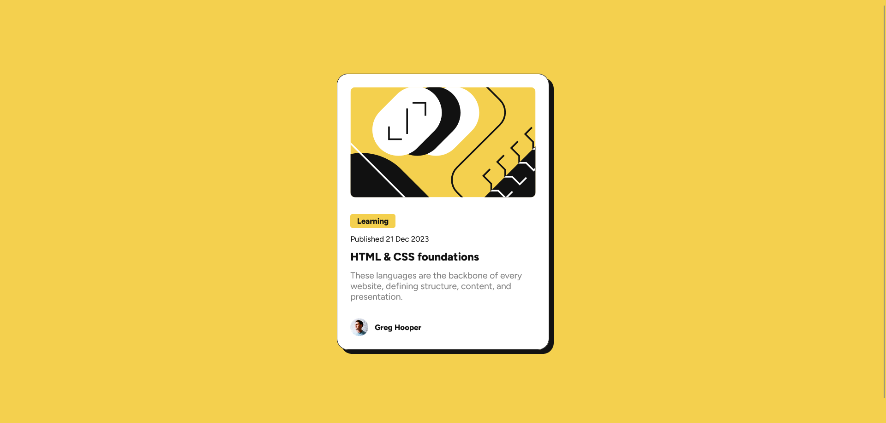

# Frontend Mentor - Blog preview card solution

This is a solution to the [Blog preview card challenge on Frontend Mentor](https://www.frontendmentor.io/challenges/blog-preview-card-ckPaj01IcS). Frontend Mentor challenges help you improve your coding skills by building realistic projects.

## Table of contents

- [Overview](#overview)
  - [The challenge](#the-challenge)
  - [Screenshot](#screenshot)
  - [Links](#links)
- [My process](#my-process)
  - [Built with](#built-with)
  - [What I learned](#what-i-learned)
  - [Useful resources](#useful-resources)
- [Author](#author)

## Overview

### The challenge

Users should be able to:

- See hover and focus states for all interactive elements on the page

### Screenshot

### Links

- Solution URL: [https://github.com/AshlavaDev/blog-preview-card](https://github.com/AshlavaDev/blog-preview-card)
- Live Site URL: [https://ashlavadev.github.io/blog-preview-card/](https://ashlavadev.github.io/blog-preview-card/)

## My process

### Built with

- Semantic HTML5 markup
- CSS variable
- Flexbox
- SASS
- Mobile-first workflow
- Prettier

### What I learned

I learned, or rather relearned, how font sizes can be made responsive to the screen size without the use of media queries. While I am used to using libraries such as Tailwind which has responsiveness to its design, I rarely use non-media query solutions to basic CSS/SASS.

### Useful resources

- [Mozzila CSS clamp()](https://developer.mozilla.org/en-US/docs/Web/CSS/clamp) - This documentation is a great way to learn about CSS clamp

## Author

- Website - [Ashley Morgan](https://www.ashleymorganwbdv.com/)
- Frontend Mentor - [@AshlavaDev](https://www.frontendmentor.io/profile/AshlavaDev)
